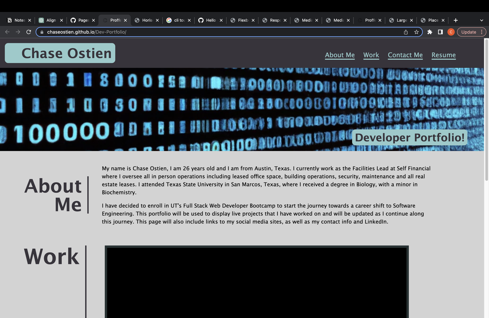

# My Developer Portfolio

## Description

The goal of this project was to practice HTML and CSS subjects including semantics, stucture, flexbox, CSS selectors, CSS variables and many more. We achieved this through the designing of a personal portfolio page that includes an about me, links to our live projects and contact information. This page is hosted live on GitHub under the repository "https://github.com/ChaseOstien/Dev-Portfolio".

## Installation

No installation needed, this webpage is hosted on github pages. 

## Usage

Screenshot of refactored webpage. 

Link to the deployed site:

https://chaseostien.github.io/Dev-Portfolio/

## Credits

I referenced multiple open source resources to assist with this project including Stack Overflow, MDN web docs and GitHub docs:

https://docs.github.com/en

https://stackoverflow.com/

https://developer.mozilla.org/en-US/

The banner image was created with the assistance of DALL-E2:

https://labs.openai.com/

Stock images were generated by:

https://placeholderimage.dev/

